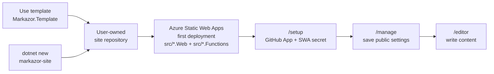
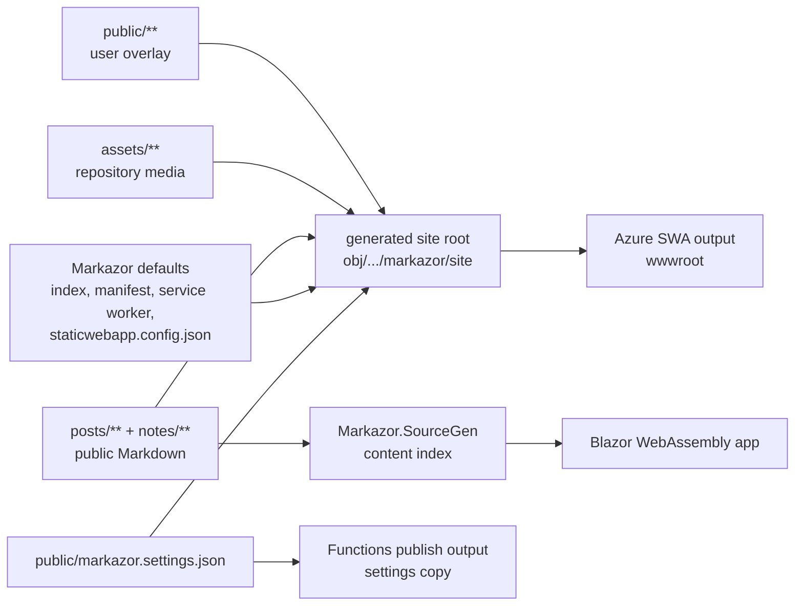
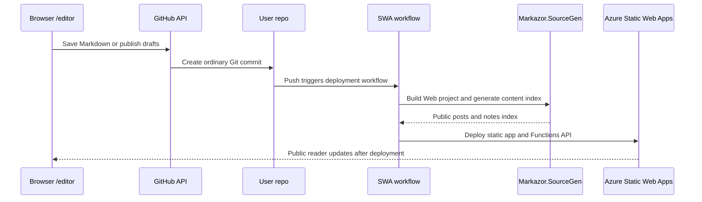

# Markazor

**Markazor is a browser-first, self-owned Blazor WebAssembly site framework for posts, notes, and static publishing on GitHub and Azure Static Web Apps.**

Markazor gives you a deployable Blazor WebAssembly reader, Azure Functions setup/auth API, `/setup`, `/manage`, and `/editor` pages, and build-time Markdown indexing through `Markazor.SourceGen`. After the first Azure Static Web Apps deployment, the rest of the setup and daily writing flow can happen from the browser.

All durable state stays in accounts you control: source code, posts, notes, drafts, media, public settings, the GitHub App, and the deployment workflow live in your GitHub and Azure resources. Browser edits become ordinary Git commits; public content is indexed at build time, while `drafts/**` stays out of publish output and service worker assets.

User-owned content stays outside generated `src/**`: Markdown lives in repository-root `posts/`, `notes/`, and `drafts/`; media lives in `assets/`; public overrides and settings live in `public/`. Advanced users still get standard .NET Blazor and Functions projects for local customization, without adopting a hosted CMS backend or control plane.

## Quick Start

### 1. Create a Site Repository

Use the [Markazor.Template](https://github.com/cloris-chan/Markazor.Template) GitHub template.

Or create a site locally:

```powershell
dotnet new install Markazor.Templates
dotnet new markazor-site -n MarkazorSite
cd MarkazorSite
```

If you created the site locally, push it to GitHub before creating the Static Web App.

### 2. Create Azure Static Web Apps

Create an Azure Static Web Apps resource for the site repository. For a site named `MarkazorSite`, use:

```text
app_location: src/MarkazorSite.Web
api_location: src/MarkazorSite.Functions
output_location: wwwroot
```

For a differently named site, replace `MarkazorSite` with your site name.

Wait for the first deployment to complete.

### 3. Finish Setup in the Browser

Open the deployed site and go to `/setup`. The page guides you through GitHub App creation, Client ID entry, Static Web Apps environment variables, GitHub authorization, and the final `/manage` settings save.

Required Static Web Apps environment variable:

```text
GITHUB_APP_CLIENT_SECRET=...
```

Recommended Static Web Apps environment variable:

```text
MARKAZOR_AUTH_COOKIE_SECRET=...
```

For the full walkthrough, see [User Guide](https://github.com/cloris-chan/Markazor/blob/main/docs/user-guide.md).

## How It Works

### Site Creation and First Setup

Both creation paths produce a user-owned site repository. Azure deploys that repository first, then the deployed site guides GitHub App authorization and public settings.



The Static Web Apps secret step is intentionally explicit. Markazor does not ask for broad Azure permissions and does not mutate the Azure management plane from the site.

### Build-Time Site Assembly

Generated Web projects opt into `MarkazorEnableSiteBuild`. During build, Markazor assembles the final web root under `src/{SiteName}.Web/obj/<Configuration>/<TargetFramework>/markazor/site/`, then lets the Blazor Static Web Assets pipeline publish that tree as `wwwroot`.



`public/**` is copied first, then Markazor fills missing shell files from package defaults. Repository assets are published under `/assets/**`, public Markdown is staged under `/_markazor/content/**`, and drafts are excluded from both publish output and service worker assets.

### Daily Writing and Publishing

The editor uses the live GitHub repository tree as its source of truth. Public pages use the last deployed build-time index, so a successful browser commit becomes visible after Azure Static Web Apps rebuilds and deploys the site.



Single-file edits use GitHub's Contents API. Multi-draft publishing uses Git data operations so selected drafts can move into public content in one atomic commit.

### Ownership and Secret Boundaries

Markazor keeps secrets in Azure Static Web Apps environment variables, public settings in the repository, and browser authorization scoped to the selected GitHub App installation.

| Boundary | Contains | Write path |
|---|---|---|
| User browser | GitHub App Client ID, short-lived access token, protected refresh cookie | Calls the Functions API for setup/auth and GitHub REST API for content operations. |
| Azure Static Web Apps | Functions API, `GITHUB_APP_CLIENT_SECRET`, `MARKAZOR_AUTH_COOKIE_SECRET` | Exchanges OAuth codes and issues/verifies protected cookies. |
| GitHub App | selected-repository installation, Contents read/write permission | Grants the browser session scoped repository access after authorization. |
| GitHub repository | posts, notes, drafts, assets, `public/markazor.settings.json`, public overlays, source code, workflow | Receives ordinary commits for content, assets, and public settings changes. |

The GitHub App Client ID is not a secret and can be stored in `public/markazor.settings.json`. The Client Secret belongs in Static Web Apps environment variables. `MARKAZOR_AUTH_COOKIE_SECRET` is recommended as a separate long random value for OAuth cookie protection.

## Repository Model

Generated sites use fixed repository-root folders:

```text
src/{SiteName}.Web/        Blazor WebAssembly reader, setup, manage, and editor UI
src/{SiteName}.Functions/  Azure Functions API for setup status and GitHub OAuth
posts/                     Public posts, created when content is written
notes/                     Public notes, created when content is written
drafts/                    Private drafts, created when drafts are written
assets/                    Markdown-referenced media assets
public/                    Public web root overlay and markazor.settings.json
```

The starter template begins with the source skeleton only. Content roots, assets, and `public/markazor.settings.json` are created later by `/editor` and `/manage`, which keeps template updates away from user-owned content.

Generated Web projects do not keep a source-controlled `wwwroot`. The final web root is built from `public/**`, repository assets, public Markdown, and Markazor package defaults during build.

## Packages

| Package | Purpose |
|---|---|
| `Markazor` | Main runtime package, UI, client services, build targets, and analyzer packaging. |
| `Markazor.Core` | Shared contracts, setup settings, GitHub client, and content path policy. |
| `Markazor.Api` | Functions-side GitHub OAuth, setup status, and endpoint implementation. |
| `Markazor.SourceGen` | Incremental source generator for public Markdown metadata. |
| `Markazor.Themes` | Built-in theme registry and build-time theme output. |
| `Markazor.Templates` | `dotnet new` template package. |

## Local Verification

```powershell
dotnet restore Markazor.slnx
dotnet build Markazor.slnx -c Release --no-restore
dotnet test Markazor.slnx -c Release --no-build
./build/Pack-Markazor.ps1 -Version <version>
./build/Test-MarkazorTemplate.ps1 -Version <version> -PackageSource artifacts/packages
```
